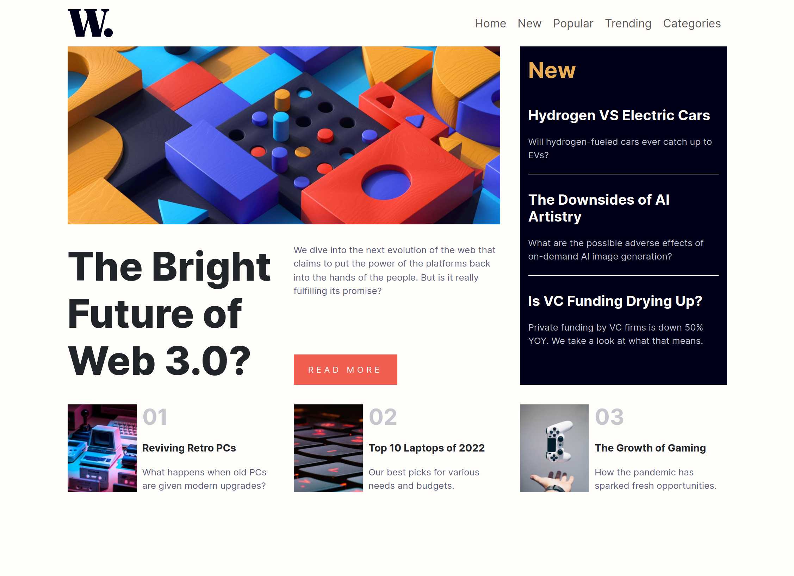

# Frontend Mentor - News homepage solution

This is a solution to the [News homepage challenge on Frontend Mentor](https://www.frontendmentor.io/challenges/news-homepage-H6SWTa1MFl). Frontend Mentor challenges help you improve your coding skills by building realistic projects. 

## Table of contents

- [Overview](#overview)
  - [The challenge](#the-challenge)
  - [Screenshot](#screenshot)
  - [Links](#links)
- [My process](#my-process)
  - [Built with](#built-with)

  - [Continued development](#continued-development)
  - [Useful resources](#useful-resources)
- [Author](#author)
- 

## Overview

### The challenge

Users should be able to:

- View the optimal layout for the interface depending on their device's screen size
- See hover and focus states for all interactive elements on the page

### Screenshot

### mobile

### desktop

### Links

- Live Site URL: [visit-live-project-site](https://cafferti.github.io/news-hfm/)

## My process

### Built with

- Semantic HTML5 markup
- CSS custom properties
- Flexbox
- CSS Grid
- Mobile-first workflow

### What I learned
basic knowlegde on grid

### Continued development

- grid
-flexbox

### Useful resources

- [mozilla-web docs](https://developer.mozilla.org/en-US/docs/Learn) - This helped me in providing all i need to know about front-end web developement. I really liked this pattern and will use it going forward.
- [font-awsesome](https://fontawesome.com) - This is an amazing website which helped me obtain all the fonts used in this project. I'd recommend it to anyone still learning this concept.

## Author

- - instagram - [@cafferti](https://www.instagram.com/dude_christiian)
- Frontend Mentor - [@cafferti](https://www.frontendmentor.io/profile/cafferti)
- Twitter - [@saulkumvee](https://www.twitter.com/saulkumvee)

